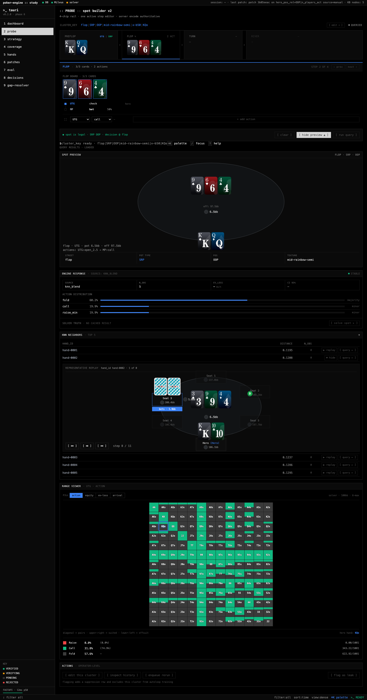
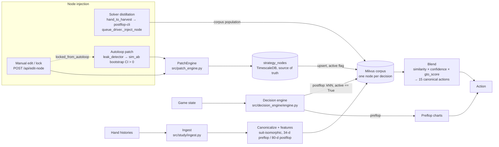

# Poker Playstyle Engine

Given a poker decision point, this tool encodes it as a feature vector, finds similar recorded decisions in a vector database and blends their actions into a recommendation. Strategies can be tested in simulated matches, and a FastAPI backend with a React frontend exposes decision lookup, hand replay, optional solver checks and evaluation.

**Tech:** Python · FastAPI · Milvus (HNSW) · PostgreSQL/TimescaleDB · NumPy/SciPy · RLCard · React + TypeScript

*Study UI: build a decision point street by street, see the engine's blended action distribution, inspect the nearest recorded hands in a replayer, and compare against a range view. Player names and hand IDs are anonymized.*

This source snapshot is for reading and local development, not a turnkey poker service or a real-money bot. The snapshot contains no usable player corpus, fitted normalization data, production equity tables, hand-history database, or solver binary. I don't claim a validated solver corpus or a working end-to-end live range viewer for it.

## Architecture

The engine does not play GTO. It starts from a real player's hand history and
lets you node-lock that strategy by injecting targeted nodes: solver-distilled
spots, manual edits, and A/B-gated autoloop patches.

- **Solver distillation** writes solved nodes straight into the corpus. It
  populates the corpus and does not go through `PatchEngine`.
- **Patches** (`source = manual | autoloop`) are recorded in `strategy_nodes`
  first, then mirrored to Milvus. Rollback flips the `active` flag.
- **Locks** (`locked_from_autoloop`) keep the autoloop off clusters you've
  pinned by hand.
- **`postflop-cli`** is an external Rust binary and is not included in this repo.

Further reading:

- [Setup and testing](docs/setup-and-testing.md): installation, build commands and known failing checks.
- [Architecture details](docs/architecture.md): full data flow, persistence and included/excluded components.
- [Security and data boundaries](docs/security-and-data-boundaries.md): local-only operation, data ownership and external requirements.
- [Third-party notices](THIRD_PARTY_NOTICES.md): retained Treys license and dependency boundaries.

## Development boundary

Run the Python code from the repository root after an editable installation. Standalone wheel installation and execution outside the checkout are **not verified**; several modules import the top-level `tools` package and resolve resources relative to the checkout.

Dependency installation and the browser production build have been verified locally. Focused mocked and configuration tests pass, but the complete test and typing checks still have failures. See [the recorded verification status](docs/setup-and-testing.md#verification-status); do not interpret a successful build as a production-readiness or full-CI claim.

This is a manually curated release, not a mirror of a private development repository. Future updates require a separate review of source, data, configuration and third-party material.

## Rights

Source is publicly viewable for portfolio review. No license is granted for reuse.

Third-party files retain the licenses identified in [THIRD_PARTY_NOTICES.md](THIRD_PARTY_NOTICES.md).
